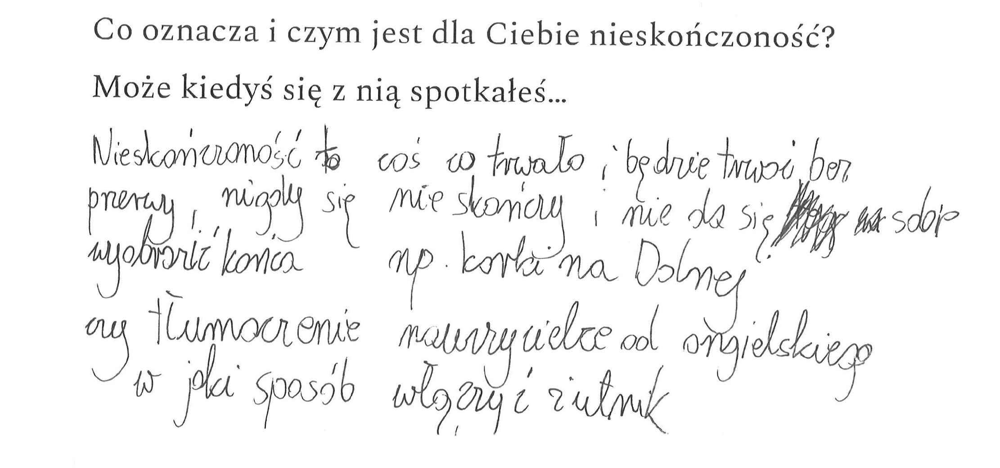
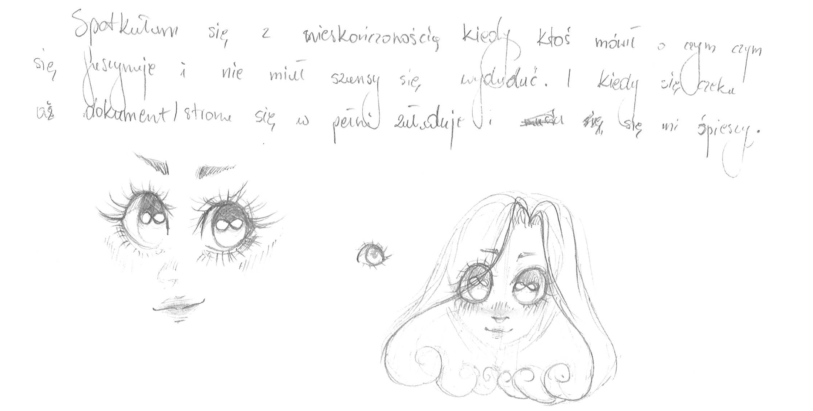
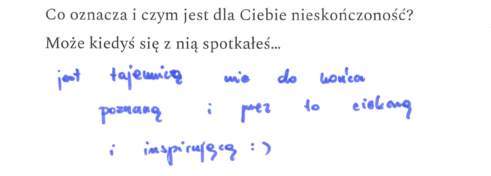
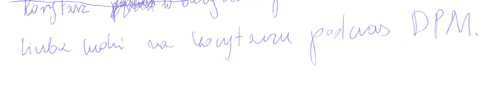
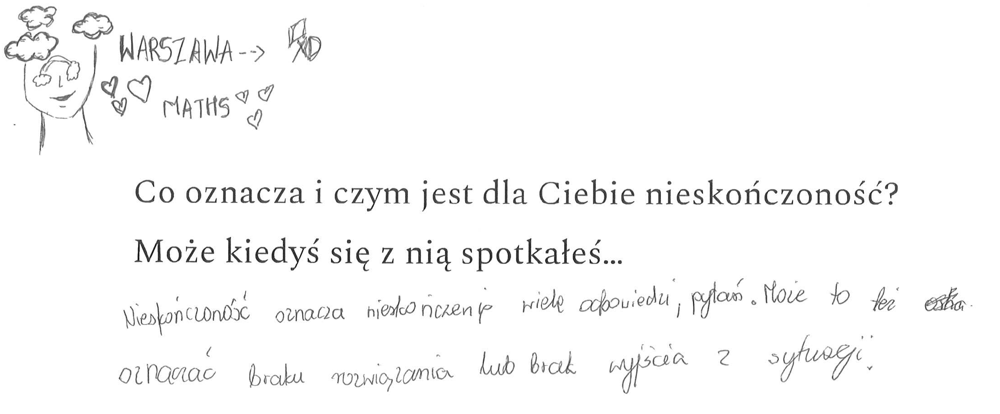
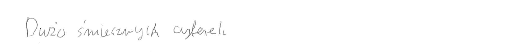
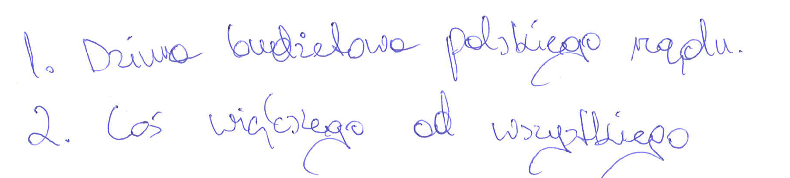
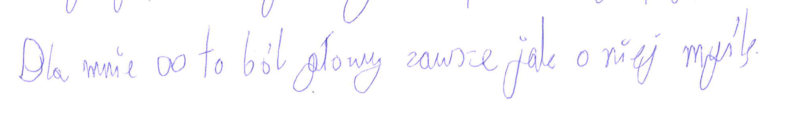
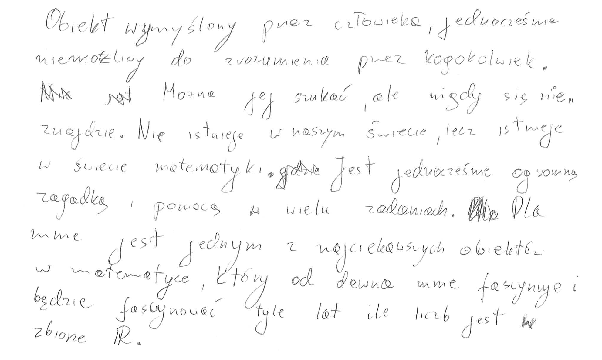
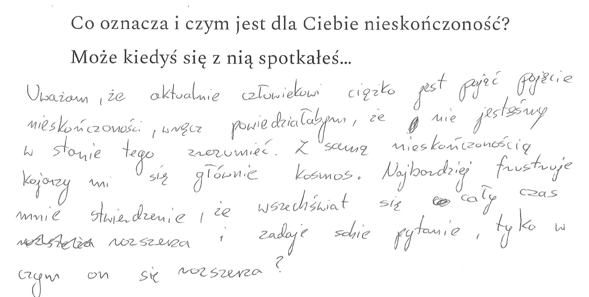

# W pogoni za nieskończonością

# Tom 1

Bezpłatny web-book: 
https://betaandbit.github.io/Nieskonczonosc/

Wersja papierowa w księgarnii: 
https://www.wuw.pl/product-pol-8579-W-pogoni-za-nieskonczonoscia.html

# Tom 2 - Szeregi

Bezpłatny web-book: 
https://betaandbit.github.io/Szeregi/#p=1

## Dzień popularyzacji matematyki 2022

Wybrane odpowiedzi uczniów z DPM-2022 na pytanie "Co oznacza i czym jest dla Ciebie nieskończoność?" 

---

---

---

---

---

---

---

---

---

---

---

